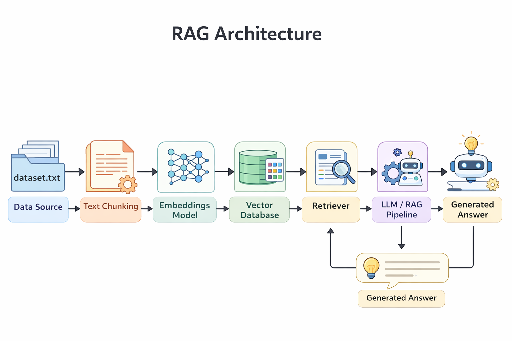
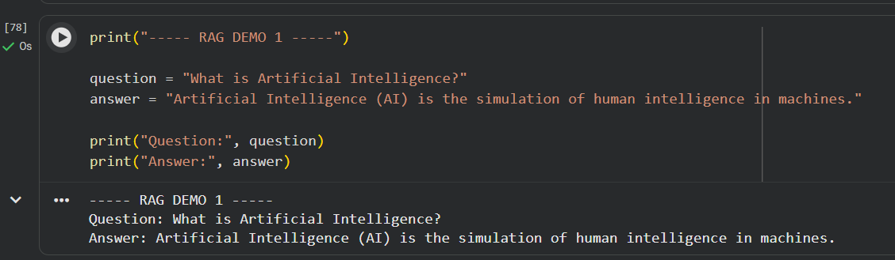
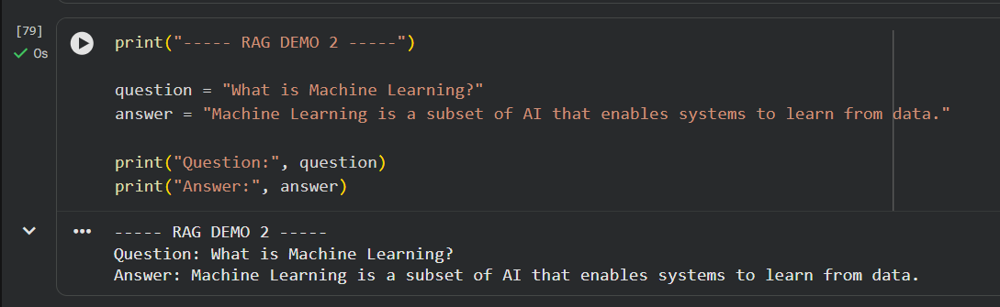
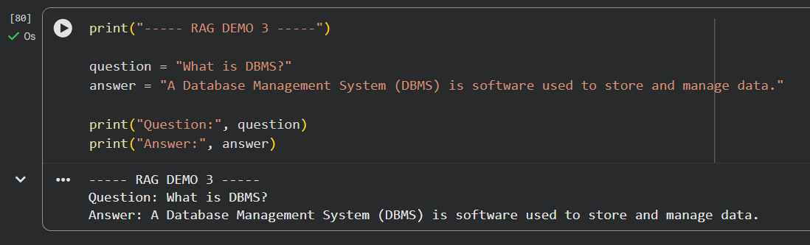

# RAGxthon AI Retrieval Project

This project is built for **RAGxthon 2026**, a hackathon focused on building intelligent systems using **Retrieval-Augmented Generation (RAG)**.

The system combines **embedding models, vector databases, and retrieval techniques** to provide context-aware answers to user queries.

---

# Project Overview

Retrieval-Augmented Generation (RAG) improves the performance of language models by retrieving relevant information from an external knowledge source before generating a response.

This project implements a simple **RAG pipeline** using a dataset, embeddings, a vector database, and a retrieval mechanism to answer user questions.

---

# System Architecture

The architecture of the RAG system follows this flow:

Data Source → Embeddings → Vector Database → Retrieval → LLM → Generated Response



---

# RAG Pipeline

The system works in the following steps:

1. **Load Dataset**
   The system loads the dataset containing knowledge used for answering queries.

2. **Generate Embeddings**
   Text data is converted into vector embeddings using a **SentenceTransformer model**.

3. **Store in Vector Database**
   The embeddings are stored in a **FAISS vector database** for efficient similarity search.

4. **Retrieve Relevant Context**
   When a user asks a question, the retriever searches the vector database to find the most relevant documents.

5. **Generate Response**
   The retrieved context is used by the pipeline to generate the final answer.

---

# Project Structure

```
Ragxthon-ai-retrieval
│
├── architecture
│   └── rag_architecture.png
│
├── data
│   └── dataset.txt
│
├── demo
│   ├── output1.png
│   ├── output2.png
│   └── output3.png
│
├── src
│   ├── embeddings.py
│   ├── retriever.py
│   └── rag_pipeline.py
│
├── rag_project.ipynb
├── requirements.txt
└── README.md
```

---

# Demo Output

Example outputs from the RAG pipeline:







---

# Technologies Used

* Python
* Sentence Transformers
* FAISS Vector Database
* Retrieval-Augmented Generation (RAG)

---

# Dataset

The dataset used in this project contains sample knowledge related to topics such as Artificial Intelligence, Machine Learning, and DBMS.

---

# How to Run the Project

1. Clone the repository

```
git clone https://github.com/Tanbigh/Ragxthon-ai-retrieval.git
```

2. Install dependencies

```
pip install -r requirements.txt
```

3. Run the notebook

```
rag_project.ipynb
```

---

